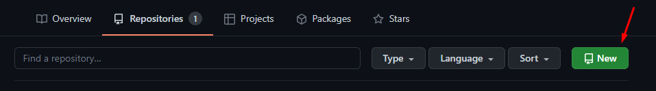
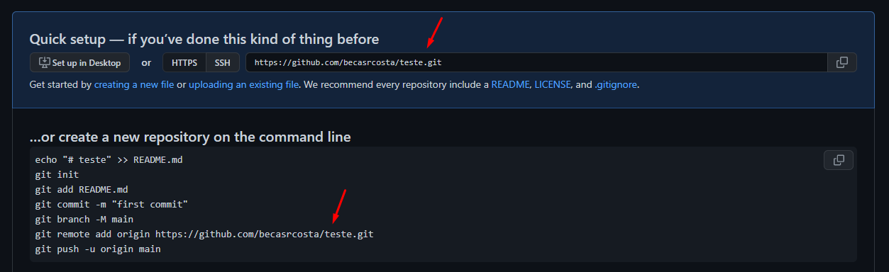
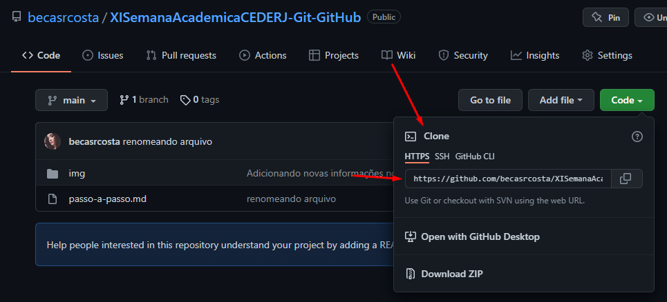
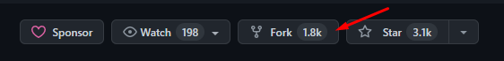

# Introdução a Git/GitHub e ao sistema de controle de versões
 
## O que é Git

O Git é um sistema de versionamento de arquivos. 

Por ser uma ferramenta de versionamento, ele nos permite ter controle de tudo o que fazemos em nossos arquivos, isto é, o que escrevemos, apagamos e alteramos neles. 

Com a sua utilização também é possível que você e seus colegas de equipe façam alterações no mesmo arquivo **no mesmo tempo** de forma que não sejam apresentados muitos problemas.

## O que é GitHub

É uma plataforma para hospedar os arquivos que estão tendo esse controle de versionamento pelo Git.

O GitHub é uma plataforma que trabalha com repositórios e que serve para que a gente possa armazenar nossos projetos nele. 

 

## Algumas recomendações

* Precisamos baixar o Git
  ( *[link para download do Git](https://git-scm.com/downloads)* )

* Para quem utiliza o Windows é recomendado o uso do Git Bash que já vem ao instalar o Git no sistema, porém quem utiliza o Linux ou Mac pode usar o terminal normalmente sem problemas.

 

## Passo a passo da criação de um projeto até a sua publicação no GitHub

### Criando a pasta do nosso projeto

* Criar uma nova pasta em seu computador com o nome do projeto.
* Abrir essa pasta em seu VSCode.
* Criar um novo arquivo da extensão desejada *(.txt, .md, .js, .html e etc)*.
* Adicionar o conteúdo desejado nesse arquivo criado.
* Salvar o arquivo.

### Iniciando o uso do Git

* Abrir o **git bash**. Pode ser aberto pelo botão direito dentro da pasta do projeto em seu computador ou pelo terminal do VSCode acessando as pastas correspondentes. 
* Precisamos utilizar o comando `git init` para inicializar o nosso **repositório**. Com isso será criada uma pasta chamada **.git** (dentro da pasta do nosso projeto) que contém todas as configurações e arquivos necessários para que tudo funcione perfeitamente, então não exclua essa pasta.

Agora iremos criar o arquivo que quisermos com seu conteúdo e após salvá-lo, vamos utilizar o comando `git add "nome do arquivo criado"` para colocar ele na área de stagging.

***Obs:** Esse add é necessário antes de dar commit no arquivo.* 

 
 

 
 

Agora que nossos arquivos estão "preparados" na staging area, podemos dar o commit para o repositório utilizando o comando `git commit -m "mensagem do commit"`.

💡​ **DICA:** A mensagem do commit precisa ter um significado, então é sempre bom analisar da melhor maneira possível a semântica da mensagem com o que está sendo enviado para que você possa ajudar sua equipe caso eles se deparem com o que foi modificado por você naquele arquivo e até mesmo ajudar o seu eu do futuro 🤭​.

Uma boa prática muito utilizada é a renomeação da **master** para a **main** e para renomear basta utilizar o comando `git branch -M "main"`. Ao criar um novo repositório utilizando o GitHub Desktop, a branch já vem com o nome de main, não sendo necessária a renomeação. 

### Interfaces Git

Existem algumas interfaces para o Git com a finalidade de facilitar a visualização de como o projeto está. 

O GitHub Desktop é uma interface visual e bem intuitiva que agiliza o nosso trabalho pois nem sempre será necessária a utilização de linhas de comando ou do navegador web. É apenas um click e tudo está feito. 

### Repositórios no Github

Após criar uma conta no GitHub, você irá clicar em "New" (Novo) para criar um novo repositório e na tela da criação preencher as informações referentes ao seu projeto. Durante esse processo podemos também configurar algumas coisas previamente, como por exemplo, se o repositório será público ou privado.

 

 

Após criado o repositório, irá aparecer uma tela cinza com alguns comandos a serem seguidos *(alguns deles já utilizados por nós, como o git init, git add, git commit e a renomeação da branch principal)*. 

Para passar o commit que foi feito do repositório local *(que está em nossa máquina)* para um repositório na plataforma do GitHub, usamos o comando `git remote add origin "link do repositório"`. Isso fará com que o nosso repositório local seja conectado com o repositório do GitHub. 

> O origin utilizado no comando acima é o nome utilizado para referenciar o nosso repositório.

 

 

Mesmo já tendo "commitado" o nosso arquivo e ter realizado essa conexão entre os repositórios local - GitHub, o commit não sobe o arquivo para a plataforma de forma automática. Então precisamos *empurrar* esses arquivos para o GitHub com o comando `git push -u origin main`.
   
Para visualizar se o nosso arquivo chegou ao repositório, basta recarregar a página do GitHub.

### Manipulando os arquivos para visualizar as modificações

Agora vamos alterar o arquivo que realizamos o commit e vamos também adicionar um novo arquivo ao nosso projeto. 

Ao finalizar as nossas alterações vamos adicioná-las ao staging area utilizando o `git add .` (para adicinar todas) ao invés de utilizar o comando *git add "nome do arquivo"*.

Logo após podemos seguir com o comando `git commit -m "mensagem do commit"`.

Para visualizar essas modificações em nosso GitHub vamos precisar dar o push `git push origin main`, porém agora sem a necessidade da utilização do -u. 

Ao olhar o nosso projeto no GitHub e clicar no nome do commit do arquivo, podemos ver as alterações feitas
  - O sinal de + com a linha verde indica as linhas que foram adicionadas.
  - O sinal de - em vermelho indica as linhas que foram removidas.

### Branch

Uma branch é uma linha do tempo alternativa ou até mesmo adicional a branch principal do projeto e que serve para que através dela sejam feitas modificações sem que isso afete a linha principal do projeto. 

Para exemplificar, vamos criar uma nova branch e ver como é feita a junção do código dela com o código que já temos na nossa branch principal (main). 

Para criar uma branch, utilizamos o comando `git checkout -b "nome da branch"`. Esse comando faz com que a gente vá diretamente para essa branch assim que for criada.

Ao criar a branch, vamos criar um novo arquivo, salvá-lo, adicionar ele em staging (`git add .`) e logo após commitar (`git commit -m "mensagem do commit"`).

Porém para enviar essas alterações para o nosso repositório será diferente pois o nome da branch agora é diferente, então seria `git push origin "nome da branch"`.

### Merge

Caso eu queira pegar todas as modificações que estão nessa nova branch e colocar na branch principal *(main)* será necessária a realização do merge.

Para isso devemos ir primeiramente para a branch que irá receber essas alterações, no caso, a branch **main**. 

Para trocar a branch usamos o comando `git checkout "nome da branch que queremos ir"` e para realizar o merge de fato usamos comando `git merge "nome da branch que queremos trazer as modificações"`. 

Para publicar essas modificações em nosso repostório dentro do GitHub usamos o comando `git push origin main`. 

### Clonando Projetos

Ao entrar em um repositório, tem um botão escrito "code" e que ao clicar aparecem alguns links. 

Para clonar um projeto, você precisa copiar esse link e dentro do terminal usar o comando `git clone <link>`. 

*Obs: Quando é clonado um repositório não será mais necessário utilizar o **git init**.*

Existe também o **fork** que é uma maneira de clonar o repostório de alguém diretamente no GitHub, sendo também mais simples, pois ao clicar no botão o projeto já aparece como um de seus repositórios. 

### Pegando modificações e atualizando seu projeto

O comando `git pull` se encarrega de pegar todas as atualizações que estão na plataforma do GitHub e atualizar o seu repositório local. 

### Pull Request

Caso você pegue o projeto de alguém pelo fork e a partir dele acaba decidindo adicionar novas funcionalidades, salvar o que foi feito e empurrar essas modificações para a plataforma, isso vai fazer com que o projeto fique com 1 commit na frente da branch original e com isso aparece a possibilidade de realizar um **Pull Request**. 

Ao clicar em Pull Resquest, ele irá identificar se existem conflitos a serem corrigidos com o que foi feito e com o que já existe no arquivo modificadp, e caso não sejam identificados conflitos, você poderá criar o pull request adicionando uma descrição e explicando as alterações que foram feitas para o dono do projeto. 

O dono do repositório original irá analisar essas modificações e vai decidir se aceita ou não essa solicitação enviada por você.
